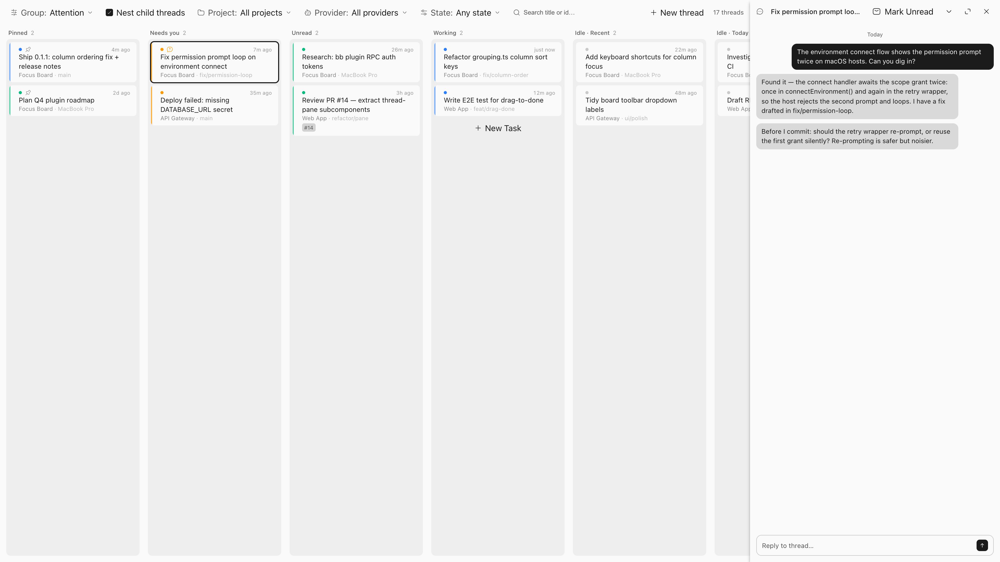
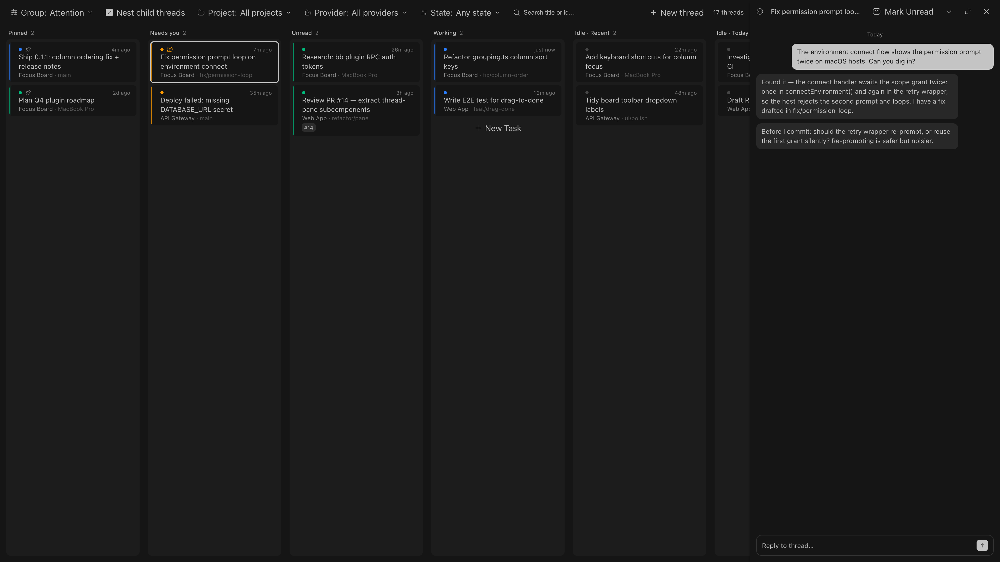
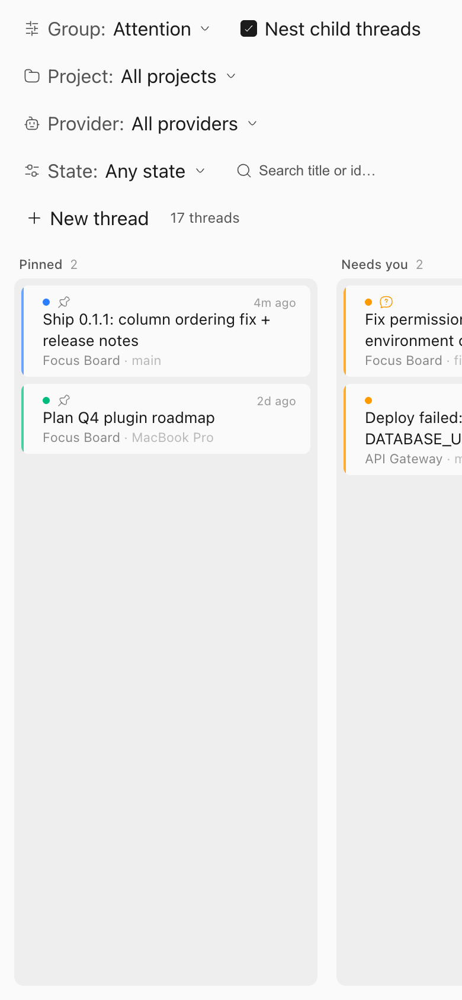
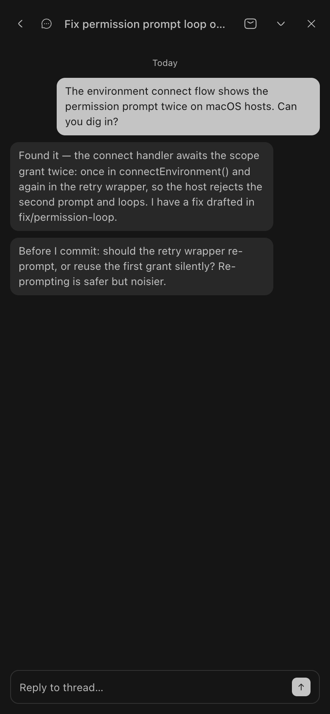

# Focus Board

<p align="center">
  A kanban board for your bb threads, grouped by what needs your attention.
</p>

<p align="center">
  <a href="#install"></a>
  
  <a href="LICENSE"></a>
</p>

<p align="center">
  <a href="docs/screenshots/board-thread-pane-dark.png">
    <picture>
      <source media="(prefers-color-scheme: dark)" srcset="docs/screenshots/board-thread-pane-dark.png">
      
    </picture>
  </a>
</p>

## What it does

The default grouping reads left to right in order of attention: **Pinned,
Needs you, Unread, Working**, then idle threads bucketed by how long
they've been quiet.

- **Group by** Attention, Last activity, Project, Provider, or Machine
- **Filter and search** by state, project, provider, or title
- **Nest** subthreads under their parent card
- **Sweep** stale Done and long-idle threads to Archive in two clicks
- **Ticket chips** with GitHub status dots, linking to the tracker
- **Thread pane** slides in beside the board; works on phone

It lives in the sidebar as a nav panel and updates in real time through
the plugin SDK.

## Screenshots

<p align="center">
  <a href="docs/screenshots/board-thread-pane-dark.png">
    
  </a>
  <br>
  <strong>Thread pane</strong> — opening a card slides in the conversation alongside the board
</p>

<p align="center">
  <a href="docs/screenshots/phone-board-light.png">
    
  </a>
  &nbsp;&nbsp;
  <a href="docs/screenshots/phone-thread-pane-dark.png">
    
  </a>
  <br>
  <strong>Phone</strong> — the toolbar stacks and columns scroll horizontally;
  the thread pane goes full screen
</p>

## Requirements

- Node ≥ 18
- bb ≥ 0.43 with plugin SDK ≥ 0.5.9
- Optional: the official GitHub plugin, for ticket status dots. Without its
  local cache, chips render without dots and everything else works.

## Install

Install straight from GitHub, no clone needed:

```sh
bb plugin install https://github.com/cristoslc/bb-plugin-focus-board
```

To update later, run the same command again (add `--yes` to skip the
confirmation prompt). To pin a version:

```sh
bb plugin install git:https://github.com/cristoslc/bb-plugin-focus-board@v0.3.1
```

## Configuration

Set sweep thresholds in Settings → Installed plugins or with the CLI:

| Setting | Default | Effect |
|---|---|---|
| `doneArchiveDays` | 7 | Done threads older than this become sweep-eligible |
| `idleArchiveDays` | 30 | Threads idle longer than this become sweep-eligible |

Any thread can be exempted from both sweeps with the card-menu
"Keep from sweep" override.

## CLI

The plugin registers one `bb` subcommand for managing its own state:

```sh
bb focus-board done list [--json]
bb focus-board done mark <thread-id>...
bb focus-board done clear <thread-id>...
bb focus-board sweep [--ids <id>...] [--confirm]
bb focus-board config show
bb focus-board config set <doneArchiveDays|idleArchiveDays> <days>
```

All commands accept `--json`. The sweep never archives without `--confirm`;
without it the command is a dry-run: it prints what would be archived and
exits 1.

## Data and privacy

The board reads bb's live thread view through the plugin SDK and writes only
pin state, read state, and Done marks through bb's own stores — never thread
content. For ticket status dots it reads the official GitHub plugin's local
cache read-only. Nothing leaves your machine.

## Development

```sh
npm install
bb plugin build
bb plugin install . --yes
bb plugin reload focus-board
# or: bb plugin dev
npm test           # vitest
npx tsc --noEmit   # typecheck
```

The screenshots in `docs/screenshots/` are captured with a harness in
`scripts/screenshot/` — see its README for usage.

## Contributing

Issues and PRs are welcome at
[github.com/cristoslc/bb-plugin-focus-board](https://github.com/cristoslc/bb-plugin-focus-board).
Run `npm test` and `npx tsc --noEmit` before submitting.

## License

[MIT](LICENSE).

## Changelog

Notable changes are documented in [CHANGELOG.md](CHANGELOG.md).