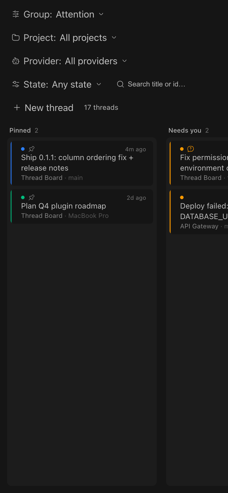

# Thread Board

A kanban board of your bb threads with Kepler-style grouping and filtering.

## What it does

- **Group** threads into columns by Attention (attention-priority lanes,
  then recency-decayed idle lanes), Last activity, Project, Provider, Machine
  (which bb host the thread runs on), or None (one flat column).
- **Filter** by project, provider, and thread state (Working / Needs you /
  Unread / Idle).
- **Search** across thread titles and ids.
- Cards show state, pin, pending-interaction badge, relative update time,
  title, and branch or host. Click opens the thread; modified-click opens it
  in a new window natively.
- Group, filter, and search selections persist per client in localStorage.
- Works on desktop and phone: columns scroll horizontally on narrow screens,
  and the thread pane goes full-screen.

The board is a nav panel at **Thread Board** in the sidebar. It reads bb's
live thread view through the plugin SDK's sidebar hooks, so it updates in
real time and makes no server-side writes. Hidden and archived threads are
excluded.

## Screenshots

| Desktop | Phone |
| --- | --- |
| **Attention grouping** — columns read left to right by priority: Pinned, Needs you, Unread, Working, then newest-first idle lanes.<br> | **Board** — the toolbar stacks and columns scroll horizontally; cards stay full width.<br> |
| **Last activity** — every thread bucketed by age, most recent leftmost.<br> | **Thread pane** — opening a card goes full screen with the conversation and reply box.<br> |
| **Thread pane** — opening a card slides in the conversation alongside the board.<br> | |

## Install

Install straight from GitHub, no clone needed:

```sh
bb plugin install https://github.com/cristoslc/bb-plugin-thread-board
```

or pin a version:

```sh
bb plugin install git:https://github.com/cristoslc/bb-plugin-thread-board@v0.1.4
```

To update later, run the same install command again (add `--yes` to skip
the confirmation prompt).

## Development

```sh
npm install
bb plugin build
bb plugin install . --yes
bb plugin reload thread-board
# or: bb plugin dev
npx tsc --noEmit   # typecheck
```