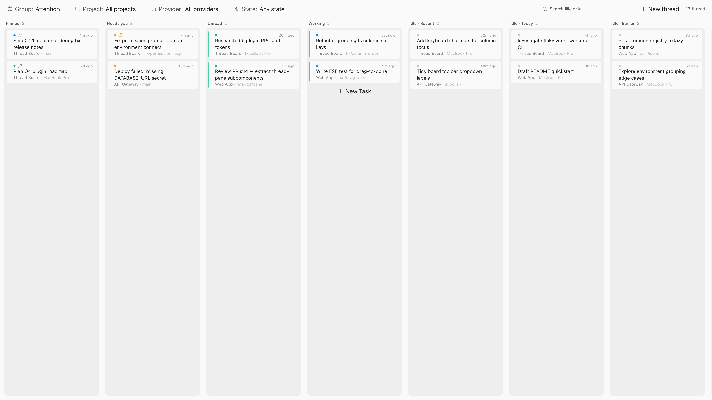
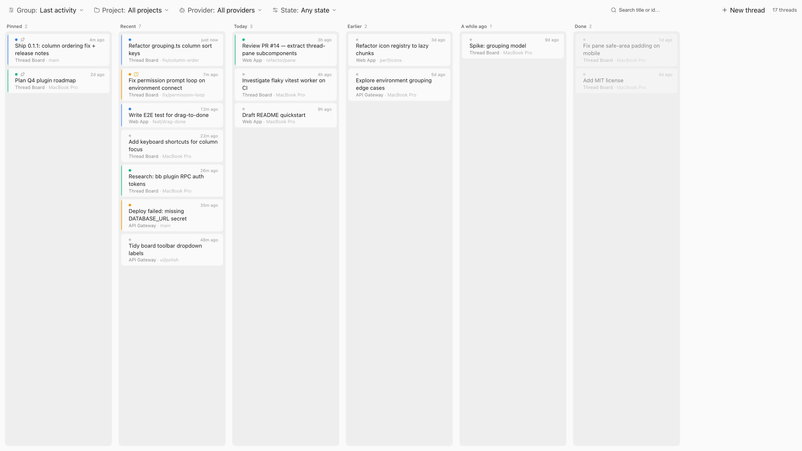
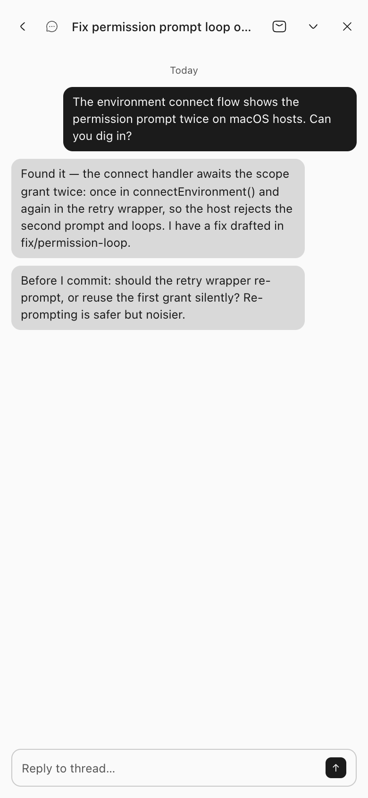

# Thread Board

<p align="center">
  A kanban board of your bb threads with grouping and filtering.
</p>

<p align="center">
  <a href="#install"></a>
  
  <a href="LICENSE"></a>
</p>

<p align="center">
  <a href="docs/screenshots/board-state-dark.png">
    <picture>
      <source media="(prefers-color-scheme: dark)" srcset="docs/screenshots/board-state-dark.png">
      
    </picture>
  </a>
</p>

## What it does

- **Group** threads into columns by Attention, Last activity, Project,
  Provider, Machine (which bb host the thread runs on), or None (one flat
  column).
- **Filter** by project, provider, and thread state (Working / Needs you /
  Unread / Idle).
- **Search** across thread titles and ids.
- Cards show state, pin, pending-interaction badge, relative update time,
  title, and branch or host. Click opens the thread; modified-click opens it
  in a new window natively.
- Group, filter, and search selections persist per client in localStorage.
- Works on desktop and phone: columns scroll horizontally on narrow screens,
  and the thread pane goes full-screen.

The board is a nav panel at **Thread Board** in the sidebar. It reads bb's
live thread view through the plugin SDK's sidebar hooks, so it updates in
real time and makes no server-side writes. Hidden and archived threads are
excluded.

## Screenshots

<p align="center">
  <a href="docs/screenshots/board-thread-pane-dark.png">
    <picture>
      <source media="(prefers-color-scheme: dark)" srcset="docs/screenshots/board-thread-pane-dark.png">
      
    </picture>
  </a>
  <br>
  <strong>Thread pane</strong> — opening a card slides in the conversation alongside the board
</p>

<details>
<summary>More screenshots</summary>

<p align="center">
  <a href="docs/screenshots/board-recency-dark.png">
    <picture>
      <source media="(prefers-color-scheme: dark)" srcset="docs/screenshots/board-recency-dark.png">
      
    </picture>
  </a>
  <br>
  <strong>Last activity</strong> — every thread bucketed by age, most recent leftmost
</p>

<p align="center">
  <a href="docs/screenshots/phone-board-dark.png">
    <picture>
      <source media="(prefers-color-scheme: dark)" srcset="docs/screenshots/phone-board-dark.png">
      
    </picture>
  </a>
  &nbsp;&nbsp;
  <a href="docs/screenshots/phone-thread-pane-dark.png">
    <picture>
      <source media="(prefers-color-scheme: dark)" srcset="docs/screenshots/phone-thread-pane-dark.png">
      
    </picture>
  </a>
  <br>
  <strong>Phone</strong> — the toolbar stacks and columns scroll horizontally;
  the thread pane goes full screen
</p>

</details>

## Install

Install straight from GitHub, no clone needed:

```sh
bb plugin install https://github.com/cristoslc/bb-plugin-thread-board
```

or pin a version:

```sh
bb plugin install git:https://github.com/cristoslc/bb-plugin-thread-board@v0.1.4
```

To update later, run the same install command again (add `--yes` to skip
the confirmation prompt).

## Development

```sh
npm install
bb plugin build
bb plugin install . --yes
bb plugin reload thread-board
# or: bb plugin dev
npx tsc --noEmit   # typecheck
```